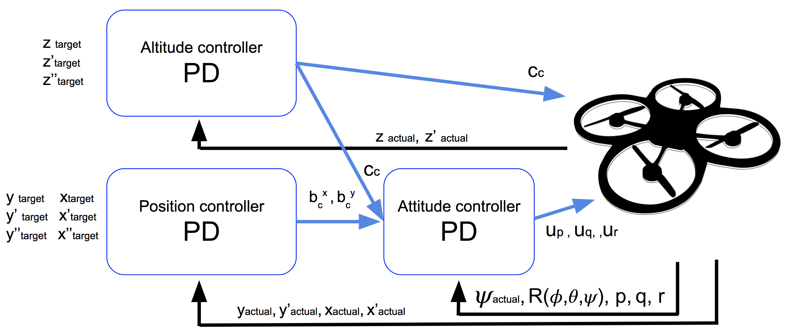

# 3D Drone Controls 

The videos in the 3D Drone Control lesson explaining drone dynamics and controllers are included in the [playlist here](https://www.youtube.com/playlist?list=PLNOpE0221wYIPqzDkwH61aslSyD8r7cRQ).
The jupyter notebook that implements all of these methods described in the videos is [here](https://github.com/Minh-An/autonomous-flight/blob/master/controls/Full%203D%20Control/Lesson%204%20-%203D%20Drone-Full-Notebook.ipynb). 

## Drone Controller Diagrams

